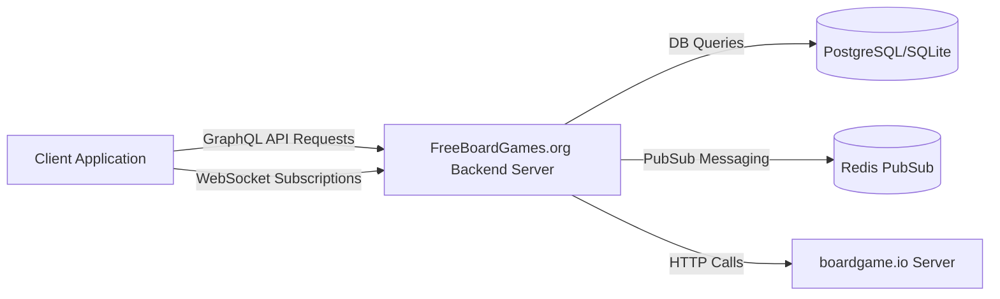
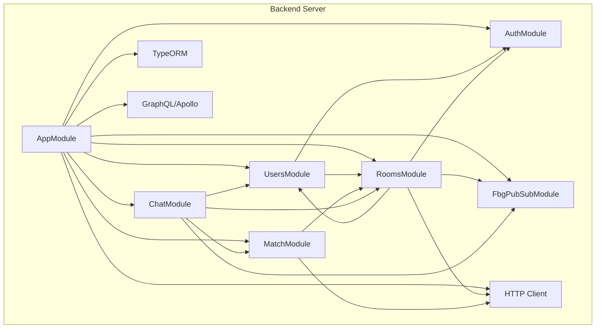

# FreeBoardGames.org Backend Server

## Project Overview

FreeBoardGames.org is an open-source platform designed to publish and host boardgame.io games, providing a curated collection of high-quality board games optimized for large-scale multiplayer delivery. The backend server is built with NestJS and exposes a GraphQL API for client interactions, supporting real-time multiplayer features through subscriptions.

### Purpose and Main Functionality
- Serve as the backend for managing users, game rooms, matches, and chat.
- Provide a GraphQL API for frontend clients to interact with game state and user data.
- Manage authentication and authorization using JWT.
- Support real-time updates via GraphQL subscriptions backed by Redis or in-memory pub/sub.
- Integrate with boardgame.io servers for match lifecycle management.

### Key Features and Capabilities
- User management with JWT-based authentication.
- Room lifecycle management including creation, joining, leaving, and user ordering.
- Match management with integration to external BGIO servers.
- Real-time chat functionality linked to rooms and matches.
- Health check endpoint for service monitoring.
- CSRF protection and CORS configuration for security.

### Likely Intended Use Cases
- Hosting multiplayer board games with real-time interaction.
- Managing game lobbies and matchmaking.
- Providing a backend API for frontend clients to build rich game UIs.

---

## Table of Contents

- [Project Overview](#project-overview)
- [Architecture](#architecture)
- [C4 Model Architecture](#c4-model-architecture)
- [Repository Structure](#repository-structure)
- [Dependencies and Integration](#dependencies-and-integration)
- [API Documentation](#api-documentation)
- [Development Notes](#development-notes)
- [Known Issues and Limitations](#known-issues-and-limitations)
- [Additional Documentation](#additional-documentation)

---

## Architecture

### High-level Architecture Overview
The backend is a modular monolith built with NestJS, structured into domain-specific modules: Users, Rooms, Match, Chat, Auth, and PubSub. It uses GraphQL with Apollo Server for API exposure and TypeORM for database interactions. Real-time features are implemented using GraphQL subscriptions with Redis-based pub/sub in production.

### Technology Stack and Frameworks
- **Backend Framework:** NestJS (Node.js)
- **API:** GraphQL with Apollo Server
- **Database:** PostgreSQL (production), SQLite (development) via TypeORM
- **Authentication:** JWT with Passport.js
- **Real-time Messaging:** graphql-subscriptions with Redis or in-memory PubSub
- **HTTP Client:** NestJS HttpModule
- **Security:** CSRF protection, CORS configuration

### Component Relationships
```mermaid
graph TD
  subgraph Backend Modules
    AppModule[AppModule]
    UsersModule[UsersModule]
    RoomsModule[RoomsModule]
    MatchModule[MatchModule]
    ChatModule[ChatModule]
    AuthModule[AuthModule]
    FbgPubSubModule[FbgPubSubModule]
  end

  AppModule -->|imports| UsersModule
  AppModule -->|imports| RoomsModule
  AppModule -->|imports| MatchModule
  AppModule -->|imports| ChatModule
  AppModule -->|imports| AuthModule
  AppModule -->|imports| FbgPubSubModule

  UsersModule -->|depends on| AuthModule
  UsersModule -->|forwardRef| RoomsModule
  RoomsModule -->|depends on| UsersModule
  RoomsModule -->|depends on| AuthModule
  RoomsModule -->|depends on| FbgPubSubModule
  RoomsModule -->|depends on| HttpModule
  MatchModule -->|depends on| RoomsModule
  MatchModule -->|depends on| HttpModule
  ChatModule -->|depends on| RoomsModule
  ChatModule -->|depends on| MatchModule
  ChatModule -->|depends on| UsersModule
  ChatModule -->|depends on| FbgPubSubModule

  AuthModule -.->|provides| JWT & Passport Services
  FbgPubSubModule -.->|provides| PubSub Service
```

### Key Design Patterns
- Modular Monolith architecture with NestJS modules.
- Dependency Injection for service management.
- Repository pattern via TypeORM entities and repositories.
- GraphQL API layer with resolvers.
- Pub/Sub messaging for real-time updates.
- Factory pattern in PubSub module to select implementation based on environment.

---

## C4 Model Architecture

<details>
<summary><strong>Context Diagram</strong></summary>



</details>

<details>
<summary><strong>Container Diagram</strong></summary>



</details>

---

## Repository Structure

| Directory/File | Purpose |
|----------------|---------|
| `fbg-server/`  | Backend NestJS server source code with domain modules (users, rooms, match, chat, auth, pubsub) |
| `web/`         | Frontend React/Next.js application with UI components, games, and infrastructure |
| `common/`      | Shared GraphQL schema files |
| `misc/`, `helm/` | Deployment scripts and utilities |
| `v2/`          | Experimental or newer version of games and web client |

Key files:
- `fbg-server/src/app.module.ts`: Root backend module
- `common/gql/schema.gql`: Auto-generated GraphQL schema

---

## Dependencies and Integration

### Internal and External Service Dependencies
- PostgreSQL or SQLite database accessed via TypeORM
- Redis for pub/sub messaging in production
- boardgame.io external server for match lifecycle management
- Internal HTTP calls for health checks
- JWT authentication integrated with Passport.js

### Event Streams or Message Queues
- GraphQL subscriptions implemented with `graphql-subscriptions` and Redis-based pub/sub

---

## API Documentation

### GraphQL API Endpoints

#### Queries
| Query | Description |
|-------|-------------|
| `user` | Returns the current authenticated user |
| `lobby` | Returns the lobby with a list of rooms |
| `match(id: String!)` | Returns a match by ID |

#### Mutations
| Mutation | Description |
|----------|-------------|
| `newUser(user: NewUserInput!)` | Creates a new user and returns a JWT token |
| `updateUser(user: NewUserInput!)` | Updates the current user |
| `newRoom(room: NewRoomInput!)` | Creates a new room and returns the room ID |
| `joinRoom(roomId: String!)` | Joins a room and returns the room details |
| `leaveRoom(roomId: String!)` | Leaves a room |
| `removeFromRoom(roomId: String!, userIdToBeRemoved: Int!)` | Removes a user from a room |
| `moveUserUp(roomId: String!, userIdToBeMovedUp: Int!)` | Moves a user up in the room's user list |
| `shuffleUsers(roomId: String!)` | Shuffles users in a room |
| `updateRoom(room: UpdateRoomInput!)` | Updates room details |
| `nextRoom(matchId: String!)` | Gets the next room for a match |
| `startMatch(roomId: String!, shuffleUsers: Boolean!, setupData: String!)` | Starts a match |
| `sendMessage(message: SendMessageInput!)` | Sends a chat message |

#### Subscriptions
| Subscription | Description |
|--------------|-------------|
| `roomMutated(roomId: String!)` | Subscription for room updates |
| `lobbyMutated` | Subscription for lobby updates |
| `chatMutated(channelType: String!, channelId: String!)` | Subscription for chat messages |

### REST Endpoint
- `GET /healthz`: Health check endpoint that internally queries the GraphQL lobby query to verify service health.

### Request and Response Models
- Input types:
  - `NewUserInput`: `{ nickname: String! }`
  - `NewRoomInput`: `{ gameCode: String!, capacity: Float!, isPublic: Boolean! }`
  - `UpdateRoomInput`: `{ roomId: String!, gameCode: String!, capacity: Float! }`
  - `SendMessageInput`: `{ channelType: String!, channelId: String!, message: String! }`
- Object types:
  - `User`: `{ id: Int, nickname: String! }`
  - `NewUser`: `{ jwtToken: String! }`
  - `Room`: `{ id: String, matchId: String, userId: Float, userMemberships: [RoomMembership!], gameCode: String!, capacity: Float!, isPublic: Boolean! }`
  - `RoomMembership`: `{ isCreator: Boolean!, position: Float!, user: User! }`
  - `Lobby`: `{ rooms: [Room!]! }`
  - `Match`: `{ id: Int, playerMemberships: [MatchMembership!], gameCode: String!, bgioServerUrl: String!, bgioMatchId: String!, bgioSecret: String, bgioPlayerId: String }`
  - `Message`: `{ channelType: String!, channelId: String!, userId: Float!, userNickname: String!, isoTimestamp: String!, message: String! }`

### Authentication & Security
- JWT tokens used for authentication, passed as Bearer tokens in Authorization header.
- Authentication enforced on GraphQL queries, mutations, and subscriptions via Passport.js JWT strategy and NestJS guards.
- CSRF protection enabled in production with cookie-based tokens.
- CORS enabled in non-production environments.

---

## Development Notes

- Follow NestJS module and service conventions.
- Use GraphQL resolvers for API endpoint implementations.
- Validate user inputs rigorously (e.g., nickname format, room capacity).
- Use transactions for atomic operations on rooms and matches.
- Testing is done with service and resolver unit tests (some `*.spec.ts` files present).
- Performance considerations include HTTP client timeouts and efficient pub/sub usage.

---

## Known Issues and Limitations

- Circular dependency between UsersModule and RoomsModule handled with `forwardRef`, which may complicate testing and maintenance.
- No explicit rate limiting implemented.
- Some features like detailed error handling and advanced matchmaking may be incomplete.
- Documentation could be improved with more architectural decision records and design docs.

---

## Additional Documentation

- See `web/README.md` for frontend development and deployment instructions.
- GraphQL schema file located at `common/gql/schema.gql` is the source of truth for API types.
- Inline code comments and service tests provide additional insights.

---

*This README was generated based on codebase analysis to assist new developers in understanding and contributing to the FreeBoardGames.org backend server.*
