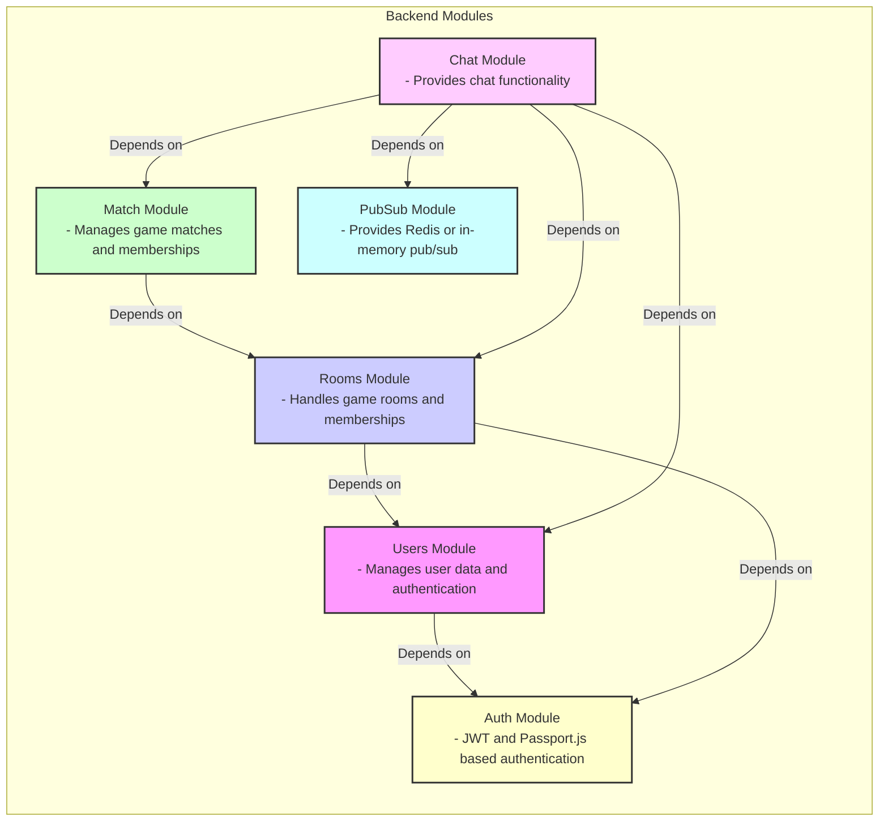
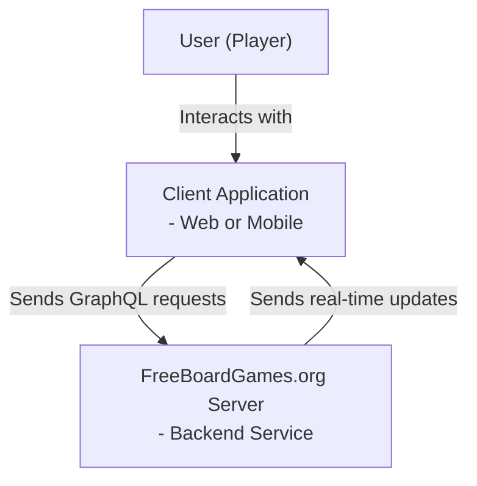
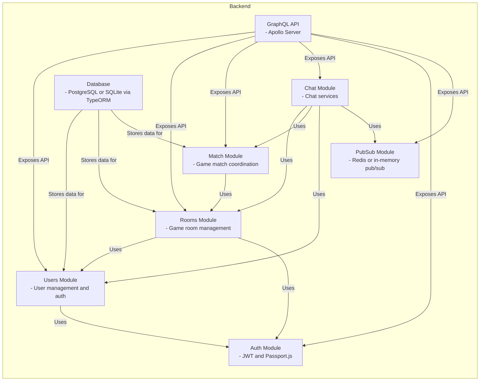

# FreeBoardGames.org Server (fbg-server)

## Project Overview

### Project Title and Concise Description
FreeBoardGames.org Server (fbg-server) is a backend service for a modular online board games platform.

### Purpose and Main Functionality
The server provides core backend functionality including user management, game room handling, match coordination, chat services, and authentication. It exposes a GraphQL API for client interaction and supports real-time features via GraphQL subscriptions.

### Key Features and Capabilities
- Modular monolithic architecture with domain-specific modules: Users, Rooms, Match, Chat, Auth, and PubSub.
- GraphQL API with Apollo Server, including subscriptions for real-time updates.
- Database support with PostgreSQL in production and SQLite for development using TypeORM.
- JWT-based authentication with Passport.js integration.
- Real-time messaging using Redis-backed pub/sub in production or in-memory pub/sub in development.
- Security features including CSRF protection and CORS configuration.
- Health check endpoint to verify service availability.

### Likely Intended Use Cases
- Hosting and managing online multiplayer board games.
- Providing real-time game state updates and chat functionality.
- Managing user sessions and authentication for game clients.

## Table of Contents
- [Project Overview](#project-overview)
- [Architecture](#architecture)
- [C4 Model Architecture](#c4-model-architecture)
- [Repository Structure](#repository-structure)
- [Dependencies and Integration](#dependencies-and-integration)
- [API Documentation](#api-documentation)
- [Development Notes](#development-notes)
- [Known Issues and Limitations](#known-issues-and-limitations)
- [Additional Documentation](#additional-documentation)

## Architecture

### High-level Architecture Overview
The backend is a modular monolith built with NestJS, structured into domain-specific modules: Users, Rooms, Match, Chat, Auth, and PubSub. It uses GraphQL with Apollo Server for API exposure and TypeORM for database interactions. Real-time features are implemented using GraphQL subscriptions with Redis-based pub/sub in production.

### Technology Stack and Frameworks
- **Backend Framework:** NestJS (Node.js)
- **API:** GraphQL with Apollo Server
- **Database:** PostgreSQL (production), SQLite (development) via TypeORM
- **Authentication:** JWT with Passport.js
- **Real-time Messaging:** graphql-subscriptions with Redis or in-memory PubSub
- **HTTP Client:** NestJS HttpModule
- **Security:** CSRF protection, CORS configuration

### Component Relationships

### Key Design Patterns
- Modular monolith architecture for clear domain separation.
- Dependency injection via NestJS modules.
- Use of GraphQL subscriptions for real-time communication.
- JWT authentication strategy with Passport.js.

## C4 Model Architecture

Context Diagram

Container Diagram

## Repository Structure

| Directory/File | Purpose |
|----------------|---------|
| `src/` | Source code for backend modules and main application |
| `src/users/` | User management module including entities, services, and resolvers |
| `src/rooms/` | Room management module including entities, services, and resolvers |
| `src/match/` | Match management module including entities, services, and resolvers |
| `src/chat/` | Chat functionality module |
| `src/internal/` | Internal utilities and shared modules like Auth and PubSub |
| `src/healthz.controller.ts` | Health check controller for service availability |
| `package.json` | Project metadata, dependencies, and scripts |

## Dependencies and Integration

- Internal dependencies between modules as per NestJS imports and exports.
- External dependencies:
  - PostgreSQL or SQLite database.
  - Redis for pub/sub messaging in production.
  - HTTP calls within modules using NestJS HttpModule.

## API Documentation

The backend exposes a GraphQL API with the following domain modules:

| Module | Description |
|--------|-------------|
| Users | User management, authentication, and JWT handling |
| Rooms | Game room creation, membership, and lobby services |
| Match | Game match lifecycle and membership management |
| Chat | Real-time chat messaging within rooms and matches |
| Auth | JWT authentication and subscription authorization |

### API Endpoints
- Single GraphQL endpoint (e.g., `/graphql`) for queries, mutations, and subscriptions.

### Request/Response Formats
- GraphQL schema auto-generated and served via Apollo Server playground in development.
- Real-time updates via GraphQL subscriptions using Redis or in-memory pub/sub.

## Development Notes

- Use NestJS conventions for module, service, and resolver organization.
- Testing with Jest configured for unit and e2e tests.
- Use environment variables for configuration such as database URLs, Redis connection, and JWT secrets.
- CSRF protection enabled in production except for localhost.
- CORS enabled in development.

## Known Issues and Limitations

- No explicit TODOs or FIXMEs found in the codebase.
- Additional documentation on API schema and module internals would be helpful.

## Additional Documentation

- See internal `.ai/docs/` directory for detailed API, data flow, dependency, request flow, and structure analyses (not included here).

---

*This README was generated automatically based on the analyzed codebase to assist new developers in understanding the project.*
