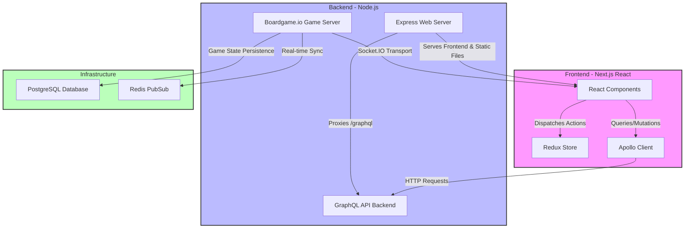
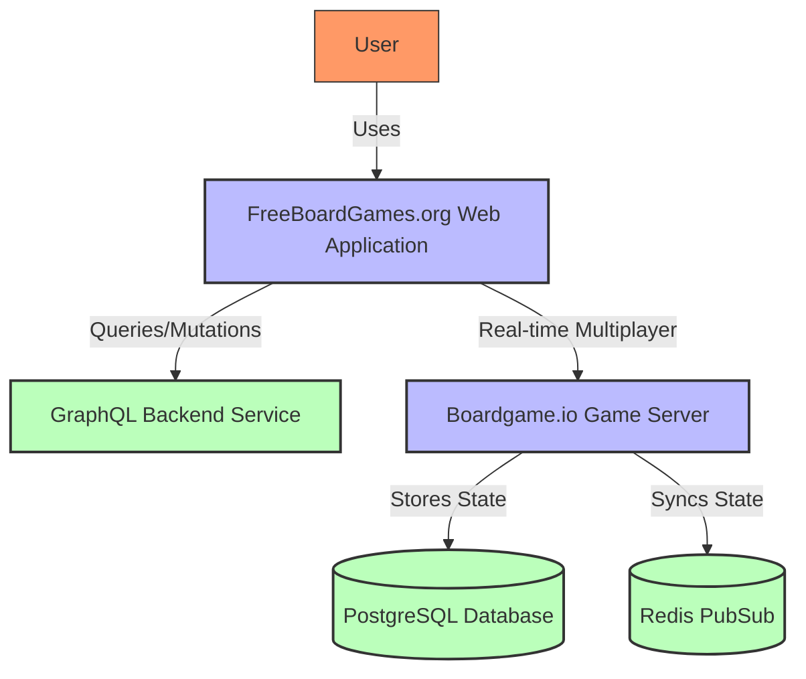
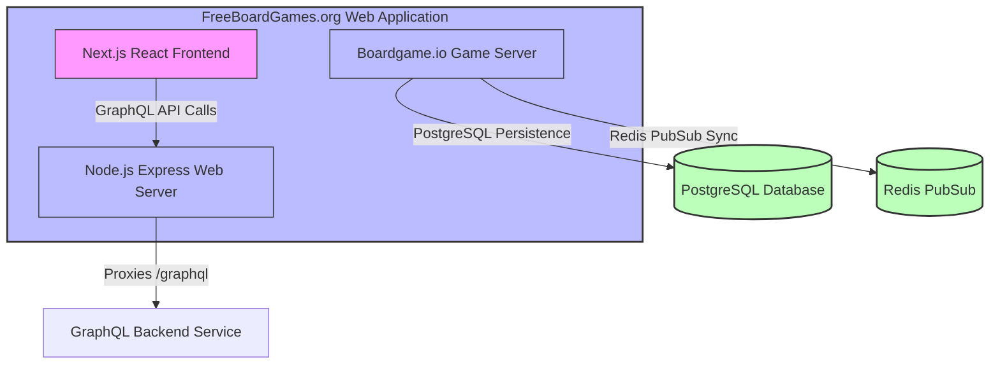

# FreeBoardGames.org Web Project

## Project Overview

FreeBoardGames.org is an open-source web platform designed to enable playing and developing multiplayer board games online. Built with modern web technologies, it provides a unified environment for game enthusiasts and developers to engage in various board games with real-time multiplayer support.

### Purpose and Main Functionality
- To offer a seamless online multiplayer board gaming experience.
- To provide a modular and extensible platform for adding new games.
- To support multiple game modes including AI, local friend, and online multiplayer.
- To integrate real-time game state synchronization and persistent storage.

### Key Features and Capabilities
- Real-time multiplayer gameplay using boardgame.io with Socket.IO and Redis PubSub.
- GraphQL API backend for lobby, user, room, and match management.
- Next.js React frontend with Redux for state management.
- CSRF protection and JWT-based authentication.
- Modular game definitions allowing easy addition of new games.
- Internationalization (i18n) support.
- Comprehensive logging and error handling.

### Likely Intended Use Cases
- Playing classic and new board games online with friends or strangers.
- Developing and testing new board games within a shared platform.
- Managing game lobbies, rooms, and matches through a web interface.

---

## Table of Contents

- [Project Overview](#project-overview)
- [Architecture](#architecture)
- [C4 Model Architecture](#c4-model-architecture)
- [Repository Structure](#repository-structure)
- [Dependencies and Integration](#dependencies-and-integration)
- [API Documentation](#api-documentation)
- [Development Notes](#development-notes)
- [Known Issues and Limitations](#known-issues-and-limitations)
- [Additional Documentation](#additional-documentation)

---

## Architecture

### High-level Architecture Overview

The system is composed of a React/Next.js frontend, a Node.js backend serving both the web frontend and a boardgame.io game server, and a GraphQL API backend. The architecture supports real-time multiplayer games with persistent state stored in PostgreSQL and synchronized via Redis PubSub.

### Technology Stack and Frameworks

- Frontend: Next.js (React), Redux, Apollo Client (GraphQL)
- Backend: Node.js, Express.js, boardgame.io server
- Real-time Communication: Socket.IO, Redis PubSub
- Database: PostgreSQL
- Security: CSRF protection with csurf, JWT authentication
- Logging: Google Cloud Logging via winston and express-winston
- Language: TypeScript

### Component Relationships

### Key Design Patterns

- Component-Based Architecture with React
- Service Layer Pattern for backend communication (LobbyService, SettingsService)
- Redux for centralized state management
- Hook-based abstractions for data fetching and configuration
- Factory pattern for rendering dynamic UI components
- Internationalization (i18n) support via hooks and HOCs

---

## C4 Model Architecture

<strong>Context Diagram</strong>

<strong>Container Diagram</strong>

---

## Repository Structure

- `/src/games/`: Individual game modules with logic, UI, and configuration.
- `/infra/common/`: Shared UI components, Redux store, services, and helpers.
- `/infra/game/`: Core game components, game provider, match handling.
- `/infra/lobby/`: Lobby and room management components and services.
- `/infra/i18n/`: Internationalization framework and hooks.
- `/infra/notification/`: Notification system components.
- `/pages/`: Next.js pages for routing and dynamic game/match views.
- `/server/`: Backend server files including Express web server and boardgame.io server.
- `/docs/`: Documentation files (not included in this README as per guidelines).

Key files:
- `server/web.ts`: Express web server entry point.
- `server/bgio.ts`: Boardgame.io game server entry point.
- `src/infra/game/Game.tsx`: Main game component.
- `src/infra/lobby/LobbyService.ts`: Service managing lobby and user state.

---

## Dependencies and Integration

- **Internal Services:**
  - GraphQL Backend Service for lobby, user, room, and match management.
  - Redis PubSub for real-time game state synchronization.
  - PostgreSQL for persistent game state storage.

- **Integration Patterns:**
  - Frontend Apollo Client communicates with GraphQL backend.
  - Express server proxies GraphQL requests and serves frontend.
  - Boardgame.io server handles real-time multiplayer game logic.

---

## API Documentation

### Express Web Server Endpoints

| Method | Path                      | Description                                      |
|--------|---------------------------|--------------------------------------------------|
| GET    | /.well-known/assetlinks.json | Serves Android app assetlinks.json on production |
| GET    | /sitemap.xml              | Serves sitemap XML                               |
| GET    | /robots.txt               | Serves robots.txt (varies by environment)       |
| GET    | /sw.js                    | Serves service worker script in production      |
| GET    | /manifest.json            | Serves web app manifest                          |
| GET    | /blog*                    | Redirects to /docs                               |
| GET    | /docs/*                   | Serves static documentation files                |
| POST   | /graphql                  | Proxies GraphQL API requests to backend          |

### Authentication & Security

- CSRF protection implemented via csurf middleware with cookie tokens.
- JWT authentication handled by GraphQL backend.
- Apollo Client sends JWT in Authorization header and CSRF token in headers.
- Unauthorized GraphQL responses trigger client-side auth invalidation.

### Boardgame.io Game Server

- Runs multiple games with PostgreSQL persistence and Redis PubSub synchronization.
- Uses Socket.IO transport for real-time communication.
- CORS enabled with configurable allowed origins.

---

## Development Notes

- Follow project conventions for React component structure and Redux state management.
- Use provided hooks for data fetching and configuration building.
- Testing is supported with Jest and React Testing Library.
- Performance considerations include efficient state updates and caching via Apollo Client.
- CSRF and JWT security mechanisms must be maintained.

---

## Known Issues and Limitations

- No explicit rate limiting or throttling mechanisms implemented.
- Some architectural diagrams and detailed documentation are marked as TODO.
- Authentication is handled externally via GraphQL backend; no direct auth in web server.
- Additional documentation on deployment and scaling would be helpful.

---

## Additional Documentation

- [Getting Started Guide](./docs/01_getting_started/1.WhyFbg.stories.mdx)
- [Infrastructure Overview](./docs/03_infra/1.Overview.stories.mdx)
- Game-specific instructions under `/src/games/*/instructions.md`

---

*This README was generated based on codebase analysis to assist new developers in understanding and contributing to the FreeBoardGames.org web project.*
